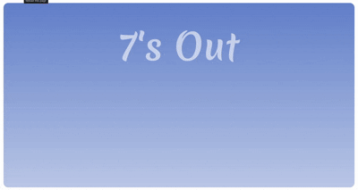

# 🎲 Sevens Out Dice Game

A fun and interactive 2-player dice game built with HTML, CSS, and JavaScript. Compete against a friend — or the computer — to reach the target score first!

[Live Link](https://sevens-out-dice-game.vercel.app)

---

## 📜 Game Rules

### 🎮 Gameplay:

- Players take turns rolling **two dice**.
- The **sum** of the dice is added to the player’s score — **unless it's 7**.
- If the **sum is 7**, the player's turn ends:
  - In **easy mode**, the score remains the same.
  - In **hard mode**, the player’s score resets to **0**.
- If a player rolls a **double** (both dice show the same number), their total score for that turn **doubles**.
- The first player to reach the **target score** wins!

### 🧠 Difficulty Levels:

- **Easy Mode**:
  - Score is safe even after rolling 7.
- **Hard Mode**:
  - Rolling a 7 resets your score to 0.

---

## 🧩 Features

- 🎲 Animated 3D dice roll
- 🧍‍♂️🧍‍♀️ 2-player mode 
- 🎯 Custom target score
- 🔄 Reset and Restart options
- 📜 Dynamic rules popup based on difficulty
- 🏆 Winner popup with smooth animation
- 📱 Mobile responsiveness

---

## ⚙️ Tech Stack

- **HTML5**
- **CSS3**
- **JavaScript (ES6+)**
- **GSAP** for animations
- LocalStorage for game settings persistence

---

## 👨‍💻 Author
Made with ❤️ by [Vedant-303](https://github.com/Vedant-303)

### 🔗 Connect with Me
[Vedant Jeughale](https://www.linkedin.com/in/vedantjeughale/)

---

## ⭐ Star this Repository
If you liked the project or found it helpful, consider giving it a ⭐ on GitHub!
